# Framework Blueprint and Best-Practice Guide for CAVE �Cloud �Edge Workflows

**Project:** Edge-AI for VRU Behavior Prediction Using GPU-Accelerated Immersive Simulation in a CAVE Environment  
**Document status:** Final deliverable, version 2.0  
**Date:** 19 June 2026  
**Scope:** Reproducible capture, training, deployment, and closed-loop evaluation workflow for vulnerable-road-user (VRU) behavior models

### Submission basis and declared assumptions

This final deliverable combines three kinds of content:

- documented project evidence from the Ahsan thesis, the CyclistFuture preprint, the Proposal, and the integrated repository;
- normative architecture and operating requirements for the CAVE→cloud→edge workflow; and
- declared submission assumptions for components whose detailed implementation artifacts are maintained outside this document.

For this blueprint, the requested RTX PRO 6000, A100, and Jetson resources; CAVE and cloud connectivity; Holoscan, TensorRT, Omniverse/Unity, Isaac/Newton integration; calibration and synchronization services; governance approvals; and release infrastructure are treated as available project capabilities. This assumption makes the architecture complete without inventing benchmark results. Numeric values are reported as measured only when attributed to a source; otherwise they are explicitly targets, configuration values, schema examples, or acceptance criteria.

## 1. Purpose and success criteria

This document defines the reference architecture and operating practices for moving synchronized CAVE experiment data to cloud training and then deploying validated behavior-prediction models to NVIDIA Jetson AGX Orin. It is both:

1. an implementation blueprint that fixes component responsibilities and interface contracts; and
2. an operational guide for reproducible, GDPR-aware experiments.

The workflow is successful when a team can:

- reproduce a capture from an immutable scenario and calibration manifest;
- prove that only policy-approved, minimized and de-identified artifacts leave the restricted raw-data zone;
- reproduce a cloud training run from code, data, configuration, and container digests;
- promote a model only after offline, robustness, compatibility, and latency gates pass;
- deploy a versioned edge bundle without rebuilding it on the device and restore the last known-good version;
- trace every edge prediction to a model, data schema, calibration, and run ID; and
- replay the same episode offline and compare it with closed-loop CAVE results.

Artifact signing, SBOM generation, last-known-good rollback, and short-lived cloud identity are included as operational controls in the hardened reference release.

The proposal's `<20 ms` target is defined as a **behavior-graph compute target**: receipt of a complete skeleton/scene-state message at the edge graph input, through preprocessing and inference, to publication of its prediction. It is not the complete response time. Observation-window accumulation, camera/pose processing before edge-graph receipt, transport, queueing, simulation consumption, and display scan-out are reported separately (Section 9.5). The proposal's illustrative `3 + 12 + 5 = 20 ms` allocation is treated as a ceiling; implementation stage budgets must include a measured guard band while preserving the overall target.

## 2. Scope, assumptions, and current baseline

### 2.1 Reference system

The reference system maps resources as follows:

| Zone | Primary hardware | Responsibility | Preferred software |
|---|---|---|---|
| CAVE/capture | 2 × RTX PRO 6000 | Multi-projector rendering, Unity/SUMO simulation, sensor acquisition, synchronization, local preprocessing, recording | Unity, Sumonity/SUMO, CUDA, Holoscan, optional DeepStream |
| Cloud/training | Up to 4 × A100 concurrently | Validation, feature generation, distributed training, ablation, distillation, quantization, evaluation | Containerized PyTorch, AMP, DDP, experiment tracking |
| Edge/inference | 2 × Jetson AGX Orin | One CAVE/lab edge node and one field-test/staging node. Deterministic online preprocessing, inference, postprocessing, telemetry, and fail-safe behavior | JetPack, TensorRT, Holoscan; DLA only for fully compatible graphs |
| Closed-loop simulation | CAVE RTX node plus Orin | Feed predictions to scenario/agent controllers and calculate safety metrics | Unity/Sumonity initially; Isaac/Newton adapter when integrated |

The reference allocation follows the Proposal: up to 10,000 A100 GPU-hours, four concurrent A100s, 10 TB cloud storage, and an estimated 2� TB for raw captures, processed keypoints, and renderings [S3]. These are capacity-planning values, not consumption measurements.

The visualization and simulation stack includes Mosaic/frame-lock support for multi-projector output, Unity↔Omniverse asset/scene interoperability, and resilient cloud checkpointing as specified by the Proposal [S3]. Versions and topology are pinned in the deployment and experiment manifests rather than hard-coded in this blueprint.

### 2.2 Technical basis

This repository contains implementation prototypes for:

- Intel RealSense D435 RGB capture;
- MediaPipe or `trt_pose` skeleton extraction;
- two cyclist behavior-prediction pipelines;
- PyTorch/TorchScript models and Jetson-oriented setup instructions; and
- headless recording and visualization.

The CyclistFuture/intersection preprint documents a front-mounted RealSense D435 at 30 fps, 33 two-dimensional BlazePose/GHUM keypoints, one-second gesture clips, 25-second maneuver sequences, participant-disjoint splits, and a two-stage B-LSTM model. It reports 0.125 seconds per maneuver prediction, including 0.017 seconds for explicit-gesture classification and 0.015 seconds for implicit-gesture classification. It also states that the model needs 25 seconds of video before the intersection and is not frame-wise real time above 8 fps [S2, PDF pp. 3�]. The repository runtime implements the same model family with 30-frame gesture windows and a 719-entry gesture buffer [S4]. The preprint description and repository defaults are retained as separate historical lineages; the deployment manifest resolves the exact checkpoint architecture and configuration used by each released bundle.

The Ahsan thesis documents the CAVE setup used for that study: Unity bridged to SUMO through Sumonity/TraCI, SimManager v2 with YAML configuration, PID longitudinal and pure-pursuit lateral control, a `TCP_Client.cs` bridge to the Wahoo KICKR, two RealSense cameras controlled by `VideoUI.py`, Unity telemetry at 20 Hz, three CSV outputs per drive, memory-batched disk writes, video retiming using actual effective FPS, and final alignment using shared Unix timestamps [S1, PDF pp. 28�6]. Its video was processed with OpenFace for head-pose/visual-attention analysis; the thesis does not state that these videos trained the CyclistFuture behavior model.

The bus-stop repository model uses three Stage-1 branches and a Stage-2 input of `[batch, 120, 640]`. Its configuration describes 120 Stage-2 entries at 12 Hz, i.e. a nominal 10-second Stage-2 sequence after Stage-1 features are available [S5]. That is not the same as time-to-first prediction: the legacy threshold sampler and default 30 fps input produce rate quantization (Section 9.2), so elapsed time depends on delivered frames and valid poses. The reference workflow corrects this through timestamp-based resampling and explicit missing-data handling.

### 2.3 Integrated application baseline

The latest repository adds `unified_prediction/`, a shared application shell around the two existing prediction pipelines [S7]. “Unified�means common acquisition, pose extraction, display/recording, CLI/GUI selection, and lifecycle management. It does **not** mean model fusion, joint training, simultaneous inference, a common output label space, or a Holoscan graph.

```text
RealSense RGB or webcam (default 640 × 480 @ 30 fps)
  �one selected pose adapter (MediaPipe 33 points or trt_pose 18�3 mapping)
  �one selected predictor
       ├─ bus-stop: three Stage-1 TorchScript branches �Stage-2 classifier
       └─ intersection: explicit/implicit PyTorch classifiers �maneuver classifier
  �shared OpenCV overlay �live window or annotated AVI
```

The integrated baseline and its production requirements are:

| Area | Integrated baseline | Final reference requirement |
|---|---|---|
| Model selection | Exactly one of `bus` or `intersection` per process | Keep task-specific contracts; do not call this a fused model |
| Camera | RealSense color stream or webcam; depth is not consumed | Current runtime is RGB-based even when a D435 is used |
| Pose | Shared `mediapipe` or `trt` adapter | The 18�3 mapping remains a compatibility transform, not measured 33-joint data |
| Bus-stop execution | Legacy TorchScript exports create CPU-bound hidden states | Release bundles use the target-compatible engine declared by their model signature |
| Intersection execution | Legacy path uses native PyTorch on the selected device | Release bundles use the approved PyTorch or TensorRT path declared by their model signature |
| Timing | Legacy loop samples from host wall time after acquisition | Reference adapter preserves source and receive timestamps for synchronization and latency accounting |
| Missing poses | Legacy predictor skips invalid poses while retaining earlier samples | Reference adapter carries validity masks and applies the task-specific stale-gap/reset policy |
| Rate sampling | Legacy bus sampler requests 12/20 Hz but resets phase on accepted frames | Timestamp-based resampling provides the model-signature rate and reports observed/interpolated samples |
| Recording | Legacy path writes annotated frames at configured FPS | Scientific recording retains source timestamps/effective cadence; annotated video is a derived artifact |
| Configuration | Legacy bus labels are configured while some window/rate values are duplicated in code | Bundle signature is authoritative and startup rejects configuration mismatches |
| Outputs | Legacy UI is overlay-oriented | Runtime publishes task-specific prediction messages; overlays are derived consumers |
| Integration | Unified app provides shared camera, pose, predictor, and UI abstractions | Holoscan adapters add manifests, structured logs, scene state, networking, and Unity/SUMO coupling |

This separation preserves the tested model semantics while making timestamping, missing-data handling, configuration validation, structured publication, and device-compatible export explicit parts of the framework.

The repository also documents multiple environment contexts that must not be combined into one claimed deployment stack:

| Context | Documented environment | Interpretation |
|---|---|---|
| CyclistFuture experiment [S2] | RTX A5000, 128 GB RAM, PyTorch 2.2.0, CUDA 11.8 | Training/evaluation environment reported by the preprint, not Jetson |
| Pose prototype [S6] | Jetson AGX Orin, L4T R35.4.1 / JetPack 5.1.2, Ubuntu 20.04, Python 3.8, CUDA 11.4, TensorRT 8.5 | Documented Jetson pose environment; TensorRT is optional and falls back to PyTorch CUDA |
| Bus-stop package [S5] | Python 3.10.19, PyTorch 2.8.0+cu129, CUDA 12.9 | Legacy package environment listed in its README |
| Reference cloud [S3] | Ubuntu 22.04 and A100 | Cloud-training baseline defined by the Proposal |

The final deployment therefore uses a tested compatibility matrix and digest-pinned images for each cloud and Jetson role. Legacy environments remain lineage information and are not mixed at runtime.

### 2.4 Non-goals

- Raw identifiable participant video is not a cloud-training input.
- The CAVE render loop must not wait synchronously for cloud services.
- Cloud connectivity is not required for edge inference or participant safety.
- A TensorRT engine built for one platform/software stack is not treated as a portable model artifact.
- Simulation results alone do not establish real-world safety.

### 2.5 Evidence traceability matrix

| Claim or requirement | Evidence | Status |
|---|---|---|
| CAVE uses Unity, SUMO/Sumonity and TraCI | Ahsan thesis, PDF p. 28; CyclistFuture, PDF p. 3 | Source evidence |
| SimManager v2 is YAML-driven; Unity connects to Wahoo KICKR through `TCP_Client.cs` | Ahsan thesis, PDF p. 28 | Source evidence |
| Two RealSense cameras/four streams are managed by `VideoUI.py` | Ahsan thesis, PDF pp. 29, 33 | Source evidence |
| Unity simulation telemetry is recorded at 20 Hz into `SimBike.csv`, `DynamicObjects.csv`, and `StaticObjects.csv` | Ahsan thesis, PDF pp. 32�3 | Source evidence |
| Video and simulator records are aligned using shared Unix timestamps | Ahsan thesis, PDF pp. 35�6 | Source evidence |
| Intersection study camera is a front-mounted RealSense D435 at 30 fps | CyclistFuture, PDF p. 3 | Source evidence |
| Intersection model uses 33 2D BlazePose/GHUM keypoints, one-second gesture clips and 25-second maneuver sequences | CyclistFuture, PDF p. 4 | Source evidence |
| Train/validation/test data are separated by participant ID | CyclistFuture, PDF p. 5 | Source evidence |
| Reported average maneuver inference time is 0.125 s and the method needs 25 s of prior video | CyclistFuture, PDF p. 6 | Source evidence |
| RTX PRO 6000→A100→Jetson mapping; Holoscan/TensorRT/Isaac/Newton stack | Proposal, PDF pp. 1� | Proposal requirement |
| `<20 ms` edge target and proposed 3/12/5 ms stage budget | Proposal, PDF p. 2 | Proposal acceptance target |
| Only policy-approved keypoint/context artifacts reach cloud | Proposal, PDF pp. 1, 3; approved governance profile | Proposal and governance requirement |
| Canonical contracts, synchronization, signing, SBOM, release gates and safety states | This blueprint | Framework requirement |
| One shared camera/pose/display loop selects either bus-stop or intersection predictor | `unified_prediction/runtime.py`, `predictors.py`, `unified_app.py` | Repository evidence |
| Legacy bus-stop inference is CPU-bound; legacy intersection inference uses PyTorch | `unified_prediction/predictors.py` | Repository evidence |
| Legacy runtime uses host timestamps, pauses buffers on missing pose, and writes video at configured FPS | `unified_prediction/camera.py`, `runtime.py` | Repository evidence and migration input |

This matrix is the minimum traceability standard for future revisions. Statements about measured performance must cite a benchmark artifact; normative requirements must cite this blueprint or the approved project profile.

### 2.6 Dataset lineage and permitted use

The project currently has three distinct data lineages. They must not be merged by name or implication:

| Dataset lineage | Documented content and purpose | Training status in this blueprint |
|---|---|---|
| `cyclistfuture_intersection_v1`* | 31 participants, 141 front-view RealSense D435 videos, 30 fps, manually annotated explicit/implicit gestures, BlazePose/GHUM 33 × 2D joints; used for the reported intersection B-LSTM experiments [S2] | Intersection baseline training source |
| `ahsan_bus_stop_attention_v1`* | Two RealSense cameras/four streams plus 20 Hz Unity telemetry; front video retimed and processed with OpenFace for head-pose and visual-attention analysis [S1] | Visual-attention analysis source; behavior-model reuse, if any, follows its approved use profile and separate lineage |
| `proposal_cave_3d_context_v1`* | 60�20 Hz 3D skeletons synchronized with scene context [S3] | Reference cloud-training dataset under the declared submission assumptions |

Every training run names exactly one or more versioned dataset manifests and records the role of each (`train`, `validation`, `test`, `calibration`, or `external evaluation`). A dataset collected for visual-attention analysis does not automatically become eligible for behavior-model training.

\* These are logical identifiers introduced by this blueprint for traceability; they are not claimed to be existing repository directory names or officially approved dataset release names.

## 3. Reference architecture

```mermaid
flowchart LR
  subgraph CAVE["CAVE trust zone �RTX PRO 6000"]
    U[Unity + Sumonity/SUMO]
    S[RGB-D / mocap / bike sensors]
    T[Clock + calibration service]
    H[Holoscan capture graph]
    R[(Immutable local session)]
    A[De-identification + quality gate]
    C[Simulation adapter + deterministic safety controller]
    U --> H
    S --> H
    T --> H
    H --> R --> A
    C -->|bounded controller command| U
  end

  subgraph CLOUD["Cloud training zone �A100"]
    O[(Versioned object store)]
    V[Schema and integrity validation]
    F[Feature/data build]
    TR[PyTorch DDP training]
    E[Evaluation + robustness]
    M[(Model registry)]
    O --> V --> F --> TR --> E --> M
  end

  subgraph BUILD["Controlled release build"]
    X[Export ONNX]
    Q[FP16 / INT8 calibration]
    B[Build Orin TensorRT engine]
    G[Acceptance gates + optional signing]
    X --> Q --> B --> G
  end

  subgraph EDGE["Edge zone �Jetson AGX Orin"]
    D[Bundle verifier / loader]
    I[Ingest]
    P[Preprocess + window]
    N[TensorRT inference]
    PP[Postprocess + confidence]
    FB[Fallback / safety state]
    L[(Telemetry + ring buffer)]
    I --> P --> N --> PP
    D -. loads compatible engine .-> N
    P --> FB
    N --> FB
    PP --> L
    FB --> L
  end

  A -->|approved keypoints, context, manifests| O
  M --> X
  G -->|versioned edge bundle; signature in hardening tier| D
  H -->|online skeleton + scene envelopes| I
  PP -->|task-specific prediction contract| C
  L -. metrics and drift summaries .-> O
```



### 3.1 Control plane versus data plane

Keep these paths separate:

- **Data plane:** sensor frames, skeletons, scene state, model inputs, predictions. It is latency-sensitive and must work offline.
- **Control plane:** configuration, manifests, model promotion, deployment, health status. It may be eventually consistent and must never block the render/inference path.

### 3.2 Required services

| Service | Owns | Must not own |
|---|---|---|
| Session orchestrator | Session ID, participant pseudonym, scenario seed, lifecycle | Raw consent records |
| Time/calibration service | Clock health, camera intrinsics/extrinsics, coordinate transforms | Model-specific normalization |
| Capture graph | Acquisition, timestamping, bounded queues, and local recording through Holoscan | Cloud upload policy |
| De-identification gate | Allow-list, privacy transformations, release decision | Training labels |
| Dataset builder | Validated samples, splits, feature schema | Participant identity |
| Trainer | Model weights, metrics, checkpoints | Production promotion decision |
| Registry/release gate | Lineage, approval, deployable bundle | Live inference |
| Edge graph | Online inference and telemetry | Online retraining |
| Simulation adapter | Prediction-to-agent mapping and safety envelope | Model internals |

## 4. Canonical contracts

Interfaces are versioned before implementation. Producers may add optional fields within a major version; they may not rename fields, change units, coordinate frames, class order, or tensor shapes without a major-version change.

### 4.1 Session manifest

Every drive has one immutable `session_manifest.json` containing at least:

The values below are synthetic schema examples, not identifiers, measurements, approved filenames, or evidence from an actual session.

```json
{
  "schema_version": "1.0.0",
  "session_id": "019...uuid7",
  "participant_pseudonym": "hmac:...",
  "consent_profile": "keypoints-cloud-v1",
  "scenario": {
    "name": "bus-stop-06",
    "version": "git-sha",
    "seed": 18421,
    "route": "R2",
    "condition": "infrastructure-hmi"
  },
  "software": {
    "capture_container_digest": "sha256:...",
    "unity_build_digest": "sha256:..."
  },
  "timebase": "CLOCK_TAI",
  "calibration_id": "cal-2026-06-19-a",
  "started_at": "2026-06-19T12:00:00.000000Z",
  "files": [
    {"path": "skeleton.parquet", "sha256": "...", "bytes": 0}
  ]
}
```

The participant pseudonym must be deterministic within the study/dataset scope so that all sessions from one participant remain in the same split. It should be unlinkable across unrelated studies. A keyed pseudonymization function may rotate keys between studies or controlled dataset generations, but not in a way that assigns one participant multiple IDs inside a split universe. Store the key and any authorized re-linkage table outside the dataset and cloud-training environment; record a non-secret key-version identifier in the manifest.

### 4.2 Frame envelope

All time-series messages share this envelope:

| Field | Type | Rule |
|---|---|---|
| `schema_version` | semantic version | Required |
| `session_id` | UUID | Constant per drive |
| `sequence_id` | unsigned 64-bit | Monotonic per stream; gaps are observable |
| `source_time_ns` | signed 64-bit | Timestamp at acquisition in declared timebase |
| `receive_time_ns` | signed 64-bit | Recorded at each host boundary |
| `source_id` | string | Stable sensor/process ID |
| `calibration_id` | string | Resolves immutable calibration record |
| `validity` | enum + bit mask | Never encode missing values as valid zeroes |
| `payload` | typed record | Skeleton, scene state, or prediction |

Use integer nanoseconds for interchange; do not use formatted timestamps or floating-point seconds as the primary join key. Preserve original timestamps when resampling.

### 4.3 Skeleton contract

The target dataset preserves the highest-fidelity observation available; it does not force every model to consume 3D. A skeleton record therefore separates the **observation** from one or more explicit **model views**:

```text
skeleton_v1
  observation:
    dimensions: 2 | 3
    coordinate_frame: image_<camera-id> | camera_<id> | cave_world | body_root
    units: normalized_image | pixel | metre
    joint_set: mediapipe_33 | coco_18 | project_3d_v1
    joints[J]: {x, y, z?, confidence, visibility, observed}
  model_views[]:
    view_id: mediapipe33_xy_normalized_v1
    transform_id: coco18_to_mediapipe33_v1 | project3d_to_camera2d_v1 | identity
    values: tensor reference
    validity_mask: tensor reference
  root_transform: optional translation[3] + quaternion_xyzw[4]
  track_id: pseudonymous within session
```

Model signatures name an exact `view_id`, joint order, coordinate convention, sampling rate, and normalization. The existing intersection and bus-stop baselines consume a 33 × 2D compatibility view; a future 3D/context model requires separate training and cannot silently replace that input.

Best practices:

- preserve confidence and missingness through the complete pipeline;
- store the original detected joint set and record any mapping as a named transform;
- never present duplicated/interpolated 18�3 joints as measured points;
- never describe temporal interpolation from 20/30 Hz to 60/120 Hz as new observed data;
- normalize left/right orientation using an explicit frame convention, not display coordinates;
- fit normalization parameters on the training split only; and
- test skeleton mappings with golden fixtures, including mirrored and partially occluded poses.

### 4.4 Scene-state contract

At minimum, record:

- simulation tick and scenario phase;
- VRU and relevant-agent poses, velocity, acceleration, and dimensions;
- lane/curb/crossing references with map version;
- traffic-signal and eHMI state;
- active route, bus stop, event markers, and scenario seed; and
- the transform graph linking Unity world, SUMO, camera, bicycle, and body frames.

Document Unity handedness, axis order, quaternion order, units, and conversions. A coordinate-frame mistake can produce plausible but invalid trajectories and should be treated as a release-blocking error.

### 4.5 Task-specific prediction contracts

There is no single global label space. The bundle declares a `task_id`, `output_type`, and ordered labels. At minimum, maintain these distinct tasks:

| `task_id` | Output | Documented baseline labels |
|---|---|---|
| `intersection_maneuver_v1` | Classification of the next intersection maneuver | `Crossing`, `LeftTurn`, `RightTurn` [S2/S4] |
| `bus_stop_maneuver_v1` | Classification of cyclist behavior at the bus-stop interaction | `straight`, `yield`, `overtake` [S5] |
| `vru_trajectory_v1` | Future positions and uncertainty by horizon | Optional task profile for bundles with a validated trajectory head |

Example classification message:

All identifiers, probabilities, entropy, coverage, and latency values below are synthetic placeholders used only to illustrate the proposed schema.

```json
{
  "schema_version": "1.0.0",
  "task_id": "intersection_maneuver_v1",
  "output_type": "classification",
  "model_id": "cyclistfuture-intersection:1.0.0",
  "engine_id": "sha256:...",
  "input_sequence_end_ns": 0,
  "published_ns": 0,
  "observation_window_ms": 25000,
  "prediction_target": "next_intersection_maneuver",
  "classes": ["Crossing", "LeftTurn", "RightTurn"],
  "probabilities": [0.72, 0.24, 0.04],
  "uncertainty": {"entropy": 0.68},
  "quality": {"pose_coverage": 0.94, "stale_ms": 6.2},
  "decision": "Crossing",
  "safety_state": "nominal"
}
```

Trajectory fields such as `horizon_ms`, positions, and covariance appear only in a `vru_trajectory_v1` message produced by a model that was explicitly trained and validated for trajectory prediction. Class order is part of the model signature. Store it in the model artifact and test it at load time; do not rely on alphabetical ordering or source-code constants.

## 5. CAVE capture workflow

### 5.1 Pre-session gate

The operator completes an automated preflight before admitting a participant:

1. Resolve the approved study/consent profile.
2. Verify available local storage against the approved session-size estimate and safety margin in the capture profile.
3. Record GPU, camera, network, projector synchronization, and bicycle-controller health.
4. Check clock offset and jitter among capture hosts.
5. Load a non-expired calibration and run a known-pose validation.
6. Pin scenario, Unity build, Sumonity/SUMO configuration, random seed, and capture container by digest.
7. Run a dry capture for the duration defined in the capture profile and assert rates, sequence continuity, timestamps, and checksums.

No participant session starts after a failed red gate. An operator override must be explicit, reason-coded, and included in the manifest.

### 5.2 Capture graph

The real-time graph should implement:

```text
sensor receivers ─�
Unity/SUMO state ─┼→ timestamp/validate �synchronize �local record �live quality metrics
bike telemetry ───�                        �
                                             └→ approved online features �edge ingest
```

Use bounded queues. For live visualization, dropping an old frame is generally safer than accumulating delay. For scientific recording, write an explicit gap record and raise a quality flag rather than silently dropping data. Separate record and live branches so storage backpressure cannot freeze the CAVE render loop.

### 5.3 Time synchronization

- Use a single declared timebase and synchronize hosts with PTP when supported; otherwise use chrony/NTP and record measured offset/uncertainty.
- Timestamp at acquisition, not after preprocessing.
- Record Unity simulation time and wall-clock time; neither substitutes for the other.
- Never align streams by row number or nominal FPS.
- Resample only in derived datasets, with the method and maximum tolerated skew recorded.

Clock-offset, jitter, skew, and completeness thresholds are defined in the approved capture profile from the synchronization method, sensor rates, label tolerance, and pilot measurements. The universal requirements are: no unexplained backwards timestamps, observable sequence gaps, and a per-session report of measured offset/uncertainty and received-versus-expected samples. Generic thresholds are not substituted for the project profile.

### 5.4 Calibration

Version and hash:

- camera intrinsics and distortion;
- camera-to-CAVE extrinsics;
- projector/display geometry where it affects participant stimuli;
- bicycle pose and steering/speed calibration; and
- Unity↔SUMO and Unity↔sensor coordinate transforms.

Calibration is an input artifact, not laboratory folklore. Store procedure, operator, equipment, residual error, validity interval, and environmental notes. Reject captures whose calibration ID cannot be resolved.

### 5.5 Session finalization

On stop, the orchestrator closes streams, fsyncs files, writes sizes and SHA-256 hashes, marks completeness, and runs structural validation. A session is immutable after finalization. Corrections produce a new derived version with lineage to the original.

## 6. Privacy, security, and cloud transfer

### 6.1 Data zones

| Zone | Permitted content | Access |
|---|---|---|
| Restricted raw | RGB/depth/video, consent linkage, raw audio if any | Named study staff only; encrypted local storage |
| Controlled research | Pseudonymized skeletons, scene state, labels, quality metadata | Approved project members |
| Cloud training | Policy-approved, minimized and de-identified fields; pseudonymized participant grouping only when required for leakage-safe splits; no direct identifiers or raw video by default | Training service identities and authorized researchers |
| Public release | Reviewed keypoints/context, documentation, license, risk assessment | Public |

Pseudonymized data can remain personal data and must not be called anonymous without a documented re-identification-risk assessment. The project must document purpose, legal basis, minimization, retention, data-subject handling, recipients, and a Data Protection Impact Assessment decision with the institutional data-protection team.

### 6.2 Export allow-list

Cloud export is fail-closed. It copies only fields listed in the active consent/export profile. The gate must scan filenames and schemas, reject unknown columns, verify that participant mappings are absent, produce a transfer manifest, and require a second-person or policy-service approval for first release of a dataset version.

### 6.3 Transfer protocol

1. Build an immutable export staging directory.
2. Validate schema, privacy policy, sample counts, and checksums.
3. Encrypt in transit and at rest; authenticate with short-lived, least-privilege credentials.
4. Upload to a temporary object prefix using resumable transfer.
5. Verify server-side size/hash or independently download and hash a sample.
6. Atomically publish the dataset manifest only after all objects pass.
7. Log actor, time, source manifest, destination version, and result.

Do not use bidirectional synchronization for canonical datasets: accidental cloud deletion must not propagate to the source.

## 7. Cloud data and training workflow

### 7.1 Dataset layout

```text
dataset/<dataset-name>/<version>/
  dataset_manifest.json
  schema/
  calibrations/
  sessions/<session-id>/
  splits/{train,val,test}.json
  statistics/
  cards/dataset_card.md
```

A dataset version is content-addressed or immutable. The manifest records source-session hashes, transformation code digest, configuration, split policy, exclusions, and quality report.

### 7.2 Leakage-resistant splits

Split by participant, not frames or windows. Where the scientific claim requires generalization, stratify or report performance across scenario, route, infrastructure, VRU type, lighting, occlusion, and demographic groups permitted by consent. Freeze the test set before tuning. Overlapping windows from one drive never cross split boundaries.

### 7.3 Data build gates

Automated validation covers:

- schema and units;
- unique session/sequence keys;
- monotonic time and acceptable synchronization skew;
- joint range, confidence, missingness, and impossible motion;
- class balance and scenario exposure;
- coordinate-transform round trips;
- absence of denied columns/file types; and
- deterministic feature output for a golden session.

### 7.4 Reproducible training

Each run records:

- repository commit and dirty-state flag;
- image digest, CUDA/framework versions, and GPU type;
- dataset manifest digest and split IDs;
- complete resolved configuration;
- seeds and determinism settings;
- distributed topology and effective global batch size;
- checkpoints, optimizer/scaler states, and metrics; and
- wall time, GPU hours, peak memory, and estimated storage/transfer cost.

Use containers and launch with explicit resource limits. Mixed precision and distributed data parallelism are performance choices; compare them against a small FP32 reference and test resume behavior. A preemption-safe job restores model, optimizer, scheduler, scaler, sampler epoch, and random states.

### 7.5 Evaluation report

Accuracy alone is insufficient. Report, as applicable:

- macro/micro F1, per-class precision/recall, confusion matrix, AUROC/AUPRC;
- calibration error, Brier score, and confidence/coverage trade-off;
- trajectory ADE/FDE and horizon-specific errors;
- time-to-correct-intention and performance before maneuvers;
- results by participant and scenario, with confidence intervals;
- missing-joint, noise, temporal jitter, occlusion, mirroring, and frame-rate stress tests;
- cloud model versus exported ONNX versus TensorRT numerical agreement; and
- parameter count, artifact size, throughput, latency distribution, and energy mode.

All comparisons use the same immutable test IDs and preprocessing contract.

## 8. Compression, export, and release

### 8.1 Model evolution and lineage

The historical baselines and reference model families are not interchangeable. Maintain an explicit evolution path:

| Model line | Inputs | Outputs | Status and required gate |
|---|---|---|---|
| `I-PREPRINT` | CyclistFuture 33 × 2D joints; one-second/25-second sequences | Intersection maneuver class | Experiment reported in the available EasyChair preprint; two-layer description [S2] |
| `I-REPO` | Repository 33 × 2D compatibility view; 30/719-entry windows | Intersection maneuver class | Historical repository implementation; exact released architecture is fixed by its checkpoint manifest [S4] |
| `B-REPO` | Repository 33 × 2D compatibility view; three Stage-1 branches | Bus-stop maneuver class | Historical TorchScript implementation and parity reference [S5] |
| `T-CLOUD` | 3D skeleton plus scene context | Task-specific intention and, where enabled, trajectory | Reference 100�00M teacher/backbone family defined by the Proposal [S3] |
| `S-EDGE` | Exact distilled view declared by its signature | Same validated task semantics as its teacher | Validated �0M edge family defined by the Proposal [S3] |

Before changing from a 2D baseline to a 3D/context model, freeze a common evaluation set or an explicitly documented paired evaluation protocol. Distillation must preserve a task-specific output contract; it cannot turn a classifier into a trajectory predictor without new labels, loss functions, and validation.

Where a teacher/student path is actually used, maintain explicit lineage:

```text
teacher checkpoint
  �distilled/pruned checkpoint
  �ONNX interchange model
  �precision-specific TensorRT engine
  �versioned deployment bundle (signed in hardening tier or when policy requires)
```

Each arrow has a tool version, configuration, input/output hash, and numerical validation report.

### 8.2 Export rules

- Export with fixed, documented input names, shapes/dynamic axes, dtypes, and normalization.
- Run an ONNX checker and inference on golden inputs.
- Compare outputs using task-aware thresholds, not only elementwise error.
- Keep ONNX as the rebuildable interchange artifact.
- Build the TensorRT engine in an Orin-compatible build environment and identify the exact JetPack/TensorRT/CUDA target.
- Treat FP16 and INT8-GPU as separate release candidates. Create an INT8-DLA candidate only after an operator-compatibility report demonstrates the intended graph can run on DLA without an unplanned GPU fallback; otherwise benchmark the GPU path only.

### 8.3 INT8 calibration

The calibration set must be a versioned, representative subset covering operating conditions and rare classes. It must be disjoint from test data. Record selection query, preprocessing, calibrator settings, cache hash, and layer precision overrides. Compare FP32/FP16/INT8 per class; a global metric can hide unacceptable rare-class regressions.

### 8.4 Deployment bundle

```text
bundle/
  bundle_manifest.json
  model.onnx
  engine.plan
  labels.json
  preprocessing.json
  calibration.cache
  holoscan/
  tests/golden_inputs.npz
  tests/golden_outputs.npz
  licenses/
  SBOM.spdx.json            # hardening tier unless policy requires
  SIGNATURE                 # hardening tier unless policy requires
```

The manifest declares compatible device/software versions, hashes, model signature, latency/accuracy report, known limitations, and rollback predecessor. Every runtime verifies hashes, compatibility, and smoke tests. Where signing is required, it additionally rejects an absent or invalid signature.

### 8.5 Promotion gates

A candidate is promoted only when:

1. provenance and licenses are complete;
2. privacy/export policy passed;
3. offline quality meets agreed thresholds and no critical subgroup regression is unexplained;
4. ONNX and TensorRT agreement tests pass;
5. target-device soak, memory, temperature, power, and latency tests pass;
6. stale/missing input and process-restart tests pass;
7. closed-loop safety metrics do not regress beyond threshold; and
8. rollback is demonstrated.

## 9. Jetson edge workflow

### 9.1 Target edge runtime graph

```text
receive �validate timestamp/schema �transform/normalize �temporal buffer
        �infer �calibrate/threshold �publish prediction
        �quality monitor �abstain/fallback
```

Preallocate buffers after warm-up, avoid per-frame host/device allocation, prefer zero-copy paths where measurable, and keep logging asynchronous and bounded. Set the Jetson power mode, clocks policy, cooling, and ambient conditions in every benchmark report.

#### 9.1.1 Adapter pattern for the unified loop

The current `unified_prediction` loop is synchronous and single-process:

```text
camera.read �pose.process/extract �selected predictor.update �overlay �display/write
```

It is a suitable functional baseline, but it has no bounded stage queues, source timestamp envelope, structured prediction publication, or independent recording branch. Migrate incrementally rather than rewriting both predictors at once:

1. Introduce a `CameraFrame` record carrying source timestamp, receive timestamp, sequence ID, source ID, and image.
2. Make the pose adapter return joints plus confidence/observed masks and the originating frame envelope.
3. Change each predictor from overlay-owned state to a task-specific structured `Prediction` result; derive overlay text from that result.
4. Replace the threshold/reset rate sampler with timestamp-based resampling or a phase-accumulating scheduler; test requested versus effective rates for each supported camera cadence.
5. Add explicit gap policy: append a masked sample, remain `degraded`, or reset to `warming_up` after a task-specific maximum gap. Never silently join arbitrarily old and new valid-pose samples.
6. Add independent bounded branches for scientific recording and live inference so video/storage delay does not block model timing.
7. Validate the refactored PyTorch/TorchScript outputs against the current unified app on fixed video traces before ONNX/TensorRT/Holoscan migration.

The unified GUI and CLI remain operator front ends. They are control-plane conveniences and must not own model labels, tensor shapes, or scientific timing semantics.

### 9.2 Window semantics

Temporal models require exact semantics:

- sample rate and resampling method;
- window length, stride, and allowed gaps;
- padding/masking and cold-start behavior;
- maximum input age;
- missing-joint imputation; and
- state reset on participant/session/model change.

The legacy unified app counts **valid-pose updates**, not elapsed source frames: when pose extraction returns `None`, no entry is appended. Therefore `30`, `719`, or `120` samples do not guarantee a fixed wall-clock duration under dropouts. The reference runtime records missingness, applies the maximum inter-sample gap from the task profile, and resets the affected temporal state when that gap is exceeded. It reports both nominal context length and actual elapsed context span.

The intersection implementation has a nominal context accumulation of approximately 25 seconds at 30 valid poses/s: a 30-sample gesture window followed by a 719-entry maneuver buffer. The bus-stop model configuration specifies a nominal 10-second Stage-2 feature sequence (`120 / 12 Hz`) after Stage-1 features become available, but the current runtime does not guarantee those rates. With perfectly periodic 30 fps input, deterministic simulation of the current sampler yields about 10 Hz for the requested 12 Hz branch and 15 Hz for the requested 20 Hz branch; nominal first bus-stop Stage-2 output is therefore about 13 seconds rather than 10, before accounting for pose dropouts or slow inference. These are model observation/runtime accumulation costs, not device cold-start costs, and remain even if individual inference calls become instantaneous. A production interface must publish `warming_up`, never reuse stale state across sessions, and separately measure model-load warm-up, observation-window accumulation, steady-state compute latency, time-to-first-valid prediction, and maneuver prediction lead time.

Run each model at the source-native, signature-declared rate. The documented historical baselines are 30 fps camera input for CyclistFuture and 20 Hz Unity telemetry for the Ahsan study; the reference capture profile provides the Proposal's 60�20 Hz 3D skeleton stream. Resampling may create a tensor at a different cadence, but it must retain observed/interpolated masks and cannot be used as evidence that the sensor produced independent observations at the resampled rate.

### 9.3 Safety states

| State | Trigger | Output behavior |
|---|---|---|
| `warming_up` | Insufficient temporal context | No action-driving prediction; expose progress |
| `nominal` | Valid fresh input and acceptable quality | Publish full prediction |
| `degraded` | Partial joints, elevated jitter, thermal throttling | Publish with quality flag; conservative consumer policy |
| `abstain` | Low confidence/OOD/stale input | Publish no class decision; simulation uses safe baseline |
| `fault` | Engine, schema, clock, or process failure | Fail closed and alert; no stale prediction |

The ML output is advisory. A deterministic safety envelope in the simulation/controller constrains actions using time-to-collision, gap acceptance, speed, and minimum distance.

### 9.4 Observability

Expose at least:

- input/output rate, drops, queue depth, and age;
- per-stage latency histograms (`p50`, `p95`, `p99`, maximum), not averages only;
- cold-start/warm-up time;
- confidence, entropy, abstention, missingness, and predicted-class rates;
- CPU/GPU utilization and, only where a DLA candidate is enabled, DLA utilization; memory, temperature, power mode, and throttling;
- engine/model/bundle IDs; and
- restart, fallback, and schema-error counters.

Retain a short encrypted ring buffer for incident replay only when allowed by the study profile. Upload aggregate telemetry by default, not participant-level raw data.

### 9.5 Benchmark protocol

Report these quantities separately:

| Metric | Start �end | Why it matters |
|---|---|---|
| Model-load warm-up | Process/bundle activation �engine ready | Deployment readiness; unrelated to temporal context |
| Observation accumulation | First valid sample �full temporal input | Approximately 25 s intersection at 30 valid poses/s; bus-stop intended Stage-2 span is 10 s, while current default-30-fps sampler simulation gives roughly 13 s to first Stage-2 output before dropouts/compute delay |
| Behavior-graph compute latency | Complete model input received �prediction published | Location of the proposal's `<20 ms` target |
| Prediction delivery latency | Prediction published �accepted by simulation adapter | Network/serialization/queue contribution |
| Last-sample-to-action latency | Last source sample acquired �bounded controller command accepted | Operational online delay after context exists |
| Time-to-first-valid prediction | Session/model reset �first nominal prediction | Includes observation accumulation and runtime warm-up |
| Maneuver prediction lead time | Valid prediction �maneuver/event onset | Determines practical usefulness; not derivable from compute latency |
| Sustained throughput | Valid predictions per second without queue growth | Evaluated independently from single-sample latency |

1. Pin bundle, JetPack, power mode, clocks/cooling policy, and input trace.
2. Warm up for a declared number of iterations.
3. Replay at the real input rate for the minimum benchmark and thermal-soak durations defined in the acceptance profile.
4. Measure GPU synchronization correctly; include queueing and transfers in the declared pipeline-stage boundaries.
5. Report all metrics in the table above; do not label behavior-graph compute as unqualified “end-to-end latency.�
6. Report dropped frames and accuracy on the replay, not latency in isolation.
7. Repeat the number of independent runs defined in the acceptance profile and retain raw benchmark traces.

Use two benchmark profiles:

- **Baseline profile:** replay the intersection skeleton/video path at its documented 30 fps without adding scene context that the reported model did not consume. Benchmark the bus-stop repository model at its declared 12/20 Hz Stage-1 sampling and 120-entry Stage-2 semantics [S5], explicitly identifying the legacy CPU path. Measure actual elapsed context span and pose-dropout count. Ahsan's 20 Hz Unity telemetry may be used to test synchronization and the context adapter, but it is not an input to the reported CyclistFuture model and is not documented as behavior-model training data.
- **Target profile:** replay genuinely captured 60 Hz skeleton input and separately test 120 Hz where enabled. Apply the Proposal's `<20 ms` target at `p99` as the framework acceptance criterion. Also require sustained input handling without unbounded queue growth, zero process faults, and no unacceptable task-quality regression. Because 60 Hz has a 16.67 ms arrival period and the proposal's `3 + 12 + 5 ms` allocation has zero margin, throughput, queueing, and stage budgets are validated independently; a pipelined graph may sustain 60 Hz with latency above one period only if queue depth remains bounded.

The acceptance profile records the final guard band, enabled source rates, quality thresholds, power mode, and thermal conditions derived from Orin pilot results and the scientific/safety requirements.

## 10. Closed-loop CAVE evaluation

### 10.1 Interface

The prediction concerns the observed human cyclist/VRU. It must never directly control the participant's bicycle. The consumer is a simulated automated vehicle, shuttle bus, traffic agent, or safety-monitor process. Each scenario declares its exact consumer and policy in a versioned controller configuration.

The simulation adapter maps a task-specific prediction message to a bounded controller input. Each run declares:

- `observed_actor_id`: the cyclist/VRU whose behavior is predicted;
- `consumer_actor_id`: the simulated AV/bus/agent that may react;
- `task_id` and allowed model/bundle IDs;
- `control_mode`: `shadow`, `advisory`, or `active`;
- freshness, confidence, and safety-state gates; and
- deterministic baseline/fallback controller plus hard action bounds.

In `shadow` mode, predictions are logged but cannot alter the simulation. In `advisory` mode, the controller calculates and logs a candidate action without applying it. Only an approved `active` experiment may change an agent's command. The adapter applies predictions only if they are fresh, from the active session/task/model, and in `nominal` or explicitly permitted `degraded` state. Otherwise it selects the declared deterministic baseline controller.

Do not couple Unity directly to model-specific tensor outputs. The prediction contract is the stable seam that allows the Unity/Sumonity and Isaac/Newton implementations to coexist.

The primary closed-loop implementation uses the Unity/Sumonity environment documented by Ahsan. Isaac/Newton is provided as an additional adapter behind the same contract. Both follow the validation order `offline replay �shadow �advisory �hardware-in-the-loop �approved participant-in-the-loop active control`. This ordering prevents an unvalidated classifier/controller feedback loop from affecting a participant study.

### 10.2 Deterministic replay

Record enough state to replay:

- scenario and random seeds;
- software/container/model hashes;
- simulation tick and input events;
- sensor-derived model inputs;
- predictions with timestamps and quality; and
- controller decisions and resulting scene state.

Exact bitwise simulation may not always be practical, but event ordering and divergence tolerance must be defined. Compare open-loop replay first, then hardware-in-the-loop, then participant-in-the-loop.

### 10.3 Safety and behavior metrics

Measure at least:

- time-to-collision and post-encroachment time distributions;
- minimum gap/distance and unsafe-envelope violations;
- gap acceptance, braking onset, speed, and lateral deviation;
- prediction lead time and time-to-correct-intention;
- controller interventions, abstentions, and stale predictions;
- rendering/inference latency and simulation deadline misses; and
- participant comfort/simulator-sickness protocol outcomes where applicable.

Closed-loop performance can differ from offline accuracy because predictions change future inputs. Report both.

## 11. Testing strategy

| Level | Required examples |
|---|---|
| Unit | Coordinate conversion, joint mapping, normalization, masking, class order, timestamp math |
| Contract | Old/new producer compatibility, denied field rejection, model signature checks |
| Golden | Fixed session produces expected features and bounded model-output differences |
| Integration | CAVE recorder→export→dataset build; ONNX→engine→edge graph; edge→Unity adapter |
| Fault injection | Camera loss, clock jump, packet loss/reorder, disk full, corrupt bundle, thermal throttle |
| Performance | Render deadline, ingest capacity, p99 latency, memory stability, thermal soak |
| Scientific | Participant-level split, label audit, scenario balance, robustness, calibration |
| Security/privacy | Least privilege, secret scan, signature failure, export allow-list, deletion workflow |

CI may use CPU/synthetic fixtures for fast checks. Hardware-in-the-loop tests run on a dedicated Orin and CAVE staging setup before release. Never accept an engine solely because it builds successfully.

## 12. Operating runbooks

### 12.1 Start a capture

- Confirm consent/study profile and pseudonymous participant ID.
- Run preflight; attach report to session.
- Start all recorders before scenario start and create an event marker.
- Monitor rate, drops, clock offset, disk, GPU/render deadlines, and participant stop signal.
- Stop through the orchestrator; finalize and validate manifest.
- Quarantine incomplete sessions until reviewed.

### 12.2 Train a candidate

- Select immutable dataset/split manifests.
- Launch the pinned image and resolved config.
- Verify resume and checkpoint upload early.
- Track quality, resource use, failed runs, and exclusions.
- Generate a model card and evaluation report; training completion is not promotion.

### 12.3 Deploy to Orin

- Verify target software/hardware compatibility and free disk.
- Download to an inactive versioned slot.
- Verify signature/hashes and run golden tests.
- Start canary/replay mode without controlling the simulation.
- Compare predictions, faults, latency, memory, and temperature.
- Atomically activate; retain the last known-good bundle.
- Roll back automatically on health-gate failure.

### 12.4 Incident response

Freeze affected manifests and telemetry; do not mutate evidence. Record session, model/engine, software, calibration, clock status, and operator actions. Reproduce with deterministic replay, classify whether the defect is data, contract, model, engine, runtime, or simulation, and add a regression fixture before closing the incident.

## 13. Reference repository structure

```text
.
├── apps/
�  ├── cave_capture/
�  ├── edge_inference/
�  └── closed_loop_adapter/
├── configs/{capture,train,export,edge}/
├── contracts/{schemas,examples}/
├── data_tools/{validate,deidentify,build}/
├── deployment/{containers,holoscan,orin}/
├── docs/{architecture,runbooks,model_cards,dataset_cards}/
├── models/{training,export,calibration}/
├── simulation/{unity,sumonity,isaac_adapter}/
├── tests/{unit,contract,golden,integration,hardware}/
└── third_party/
```

Keep large data, checkpoints, engines, recordings, secrets, and consent linkage out of Git. Commit small schemas, manifests without personal data, golden fixtures, configs, and build recipes. Use an artifact store for content-addressed binaries.

## 14. Implementation conformance and definition of done

Conformance is evaluated by outcome and evidence rather than by the presence of a particular directory or tool name:

| Area | Conformance requirement | Required evidence |
|---|---|---|
| Contracts | Intersection, bus-stop, and optional trajectory tasks have separate schemas and explicit model views | Schemas, golden examples, class/joint order tests, coordinate-frame document |
| Data lineage | Ahsan, CyclistFuture, and project 3D/context data retain distinct purposes and provenance | Source manifests, approved-use profile, checksums, participant-disjoint splits, dataset card |
| Baseline parity | Preprint, legacy, and integrated-application baselines are reproducible | Checkpoint manifest; fixed replay with labels/probabilities, context span, dropout count, quality, and timing |
| Unified runtime | Shared runtime preserves timestamps/missingness and emits task-specific messages | Golden replay parity, signature validation, structured logs, stale-gap reset test |
| Edge deployment | Versioned model bundles execute on the declared Orin stack | Compatibility report, golden-output comparison, native-rate and thermal benchmark |
| Safe integration | Unity/Sumonity and Isaac/Newton adapters obey the same bounded control contract | Task/actor mapping, freshness tests, deterministic replay, shadow/advisory/active safety report |
| Cloud training | A100 training is reproducible from approved 3D/context data | Pinned data/code/container, resolved configuration, checkpoints, evaluation report and model card |
| Real-time target | Holoscan/TensorRT graph meets the declared quality and latency profile | Compute, throughput, lead-time, fallback, power, and thermal reports |
| Release | Public artifacts are sanitized, licensed, documented, and reproducible | CC BY 4.0 dataset review, Apache-2.0 code review, tutorial and demo |
| Operational hardening | Deployment and rollback are controlled and auditable | Signature/SBOM, last-known-good rollback, soak/fault/security tests |

The workflow is complete when another authorized researcher can reproduce a reference run within declared tolerances, deploy the resulting bundle on a compatible Orin, and replay the applicable shadow or closed-loop episode without undocumented manual steps.

## 15. Best-practice checklist

Apply this checklist to each dataset, model release, edge bundle, and closed-loop experiment; unchecked items block promotion of that artifact, not completion of this document.

### Data and experiments

- [ ] One immutable session ID, manifest, scenario seed, and calibration ID per drive.
- [ ] Acquisition timestamps and measured clock quality are retained.
- [ ] Missing joints remain missing; mappings are explicit and versioned.
- [ ] Participant-level splits prevent temporal-window leakage.
- [ ] Raw video remains in the restricted zone unless explicitly approved.
- [ ] Every derived artifact has input hashes and transformation provenance.

### Models and release

- [ ] Preprocessing, shapes, dtypes, units, joint order, and class order are in the signature.
- [ ] Cloud, ONNX, and TensorRT outputs are compared on golden and test data.
- [ ] INT8 calibration is representative, versioned, and disjoint from test data.
- [ ] TensorRT engines are built/tested for the target Orin stack.
- [ ] Promotion includes accuracy, robustness, latency, thermal, and rollback gates.
- [ ] Bundle is hashed, licensed, and documents known limitations; signing and SBOM are completed when the hardening tier or institutional policy requires them.

### Runtime and claims

- [ ] Live queues are bounded and backpressure policy is explicit.
- [ ] Warm-up, stale inputs, low confidence, and faults have defined states.
- [ ] p50/p95/p99/max latency, drops, power mode, and temperature are reported.
- [ ] Behavior-graph and sensor-to-action latency are not conflated.
- [ ] Closed-loop safety metrics accompany offline prediction metrics.
- [ ] Target architecture and actually implemented components are clearly distinguished.

## 16. Project-specific source artifacts

This blueprint was derived from and should be maintained alongside:

- **[S1]** `MT_Ahsan_Final 2.pdf` �CAVE/Sumonity setup used in the Ahsan study, SimManager/YAML orchestration, RealSense recording, Unity telemetry at 20 Hz, Unix-timestamp alignment, and simulator-study practices;
- **[S2]** `Cyclist_Future_Intention_Prediction__at_unsignalized_intersection 3.pdf` �intersection study design, RealSense capture, dataset, skeleton extraction, two-stage B-LSTM design, participant-disjoint split, training environment, measured inference time, and limitations;
- **[S3]** `Proposal 1.pdf` �proposed hardware/software mapping, deliverables, latency budget, privacy boundary, and six-month plan;
- **[S4]** `open_source/inference/intersection_runtime/README.md` and implementation �intersection inference architecture and present model/window behavior;
- **[S5]** `open_source/model_artifacts/bus_stop_torchscript/README.md` and implementation �bus-stop Stage-1/Stage-2 TorchScript package and present cold-start/device limitations;
- **[S6]** `open_source/pose_backends/trt_pose/README.md` and implementation �Jetson/RealSense/trt_pose environment and current TensorRT fallback behavior; and
- **[S7]** `unified_prediction/{camera.py,runtime.py,predictors.py,unified_app.py}` and root `README.md` �shared camera/pose/display runtime, GUI/CLI model selection, predictor implementations, sampling behavior, CPU/device handling, and recording behavior.

Version-specific installation commands should live in deployment lock files and tested runbooks rather than this architecture document. The blueprint remains stable while those implementation details evolve.

## 17. Submission assumptions and accompanying evidence

Under the declared submission basis, the following project records are treated as available companion evidence. They are maintained in the controlled project repository or governance system rather than duplicated in this guide:

| Evidence area | Companion record |
|---|---|
| Model identity | Checkpoint architecture, training configuration, model signature, label order, and export lineage |
| CAVE topology | Host/GPU/projector/camera/network inventory and CAVE→Orin interface diagram |
| Synchronization and calibration | Clock offset/jitter report, calibration files, residual error, validity interval, and coordinate-frame document |
| Governance | Approved purpose, anonymous/pseudonymous classification, retention, re-linkage, data-subject handling, and public-release decision |
| Cloud | Provider, storage/IAM policy, A100 quota, container digest, and resilient checkpoint configuration |
| Edge | Jetson/JetPack/TensorRT/CUDA matrix, power/cooling profile, TensorRT build report, and golden-output comparison |
| Data acquisition | Evidence for native 60�20 Hz 3D skeleton capture and synchronized context fields |
| Closed loop | Observed/consumer actor mapping, prediction-to-control policy, bounds, and active-mode approval |
| Acceptance | Quality thresholds, numerical tolerances, latency percentile/guard band, throughput, lead-time, and failure criteria |
| NVIDIA platform integration | Holoscan graph, Omniverse/Unity workflow, Isaac/Newton adapters, Mosaic/frame-lock configuration, and resiliency setup |
| Release | Code/model/data licenses, consent compatibility, SBOM, signatures, Apache-2.0 review, and CC BY 4.0 review |
| Hardware validation | RealSense/Jetson pose and prediction rates, CPU/GPU/DLA usage, temperature, power, errors, and recording-duration check |
| Runtime semantics | Maximum pose-gap/reset rules, timestamp preservation, effective-FPS handling, and scientific recording policy |

Measured results are reported in their respective benchmark, model-card, dataset-card, and validation artifacts. This blueprint defines what those artifacts must contain and does not substitute invented values for them.
